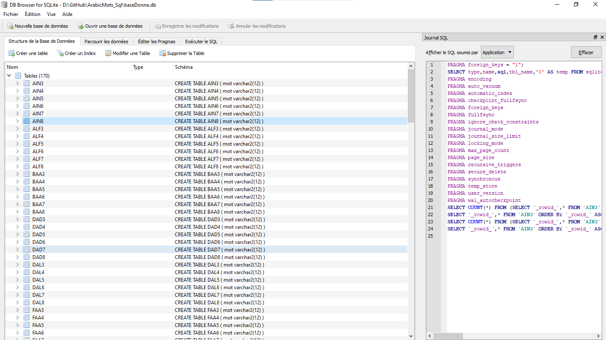
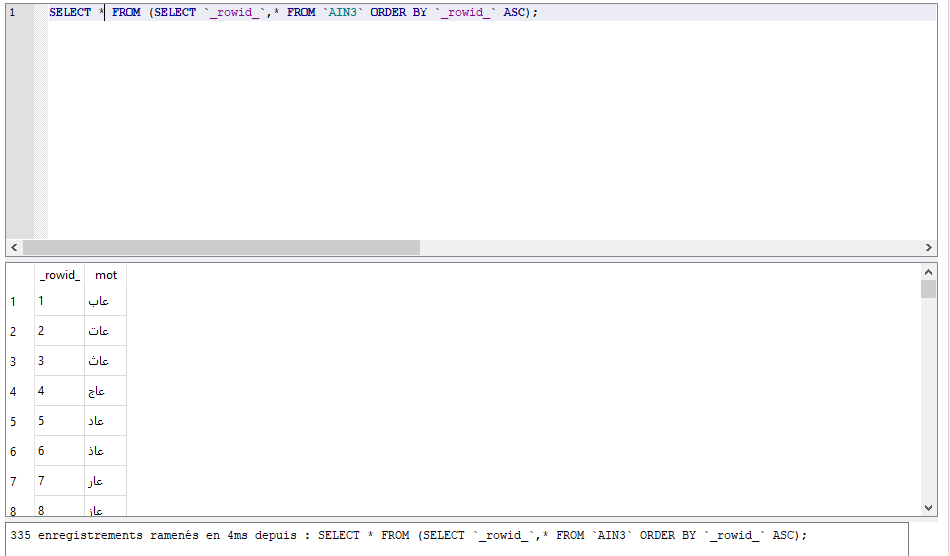
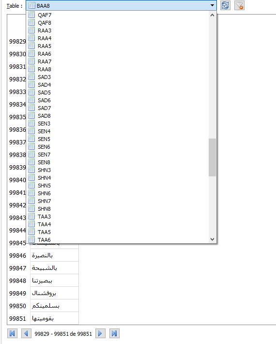

# Arabic words

## All Arabic words from 3 to 9 letters

More than 12 million words divided by the number of letters and the type of letter for easy finding

> قائمة ب 1272533 كلمة عربية تم جمعها من أكثر من 650 كتابا قديما وحديثا  
> This project is a fork of 
>[ OSINTAI / Arabic_Words](https://github.com/OSINTAI/Arabic_Words)


جميع كلمات اللغة العربية من 3 احرف ل 9 احرف
تكتر من 8 مليون كلمة
الكلمات مقسمة على جداول على حسب الحرف و طول الكلمة

## Download
##### DB Browser for SQLite 
https://sqlitebrowser.org/dl/

##### Extract <strong> baseDonne.rar </strong> and choose the destination folder ==> baseDonne.db
##### Run SQLiteDatabaseBrowser and Open database from <strong> baseDonne.db </strong>

<div align="center">
	<h1>
		ScreenShots from SQLite Database 
	</h1>
	
	
	
</div>

<br>
<br>
<br>

## Java Code Exemple :

```sh

/** Determine if the word exists in the Arabic language.
* @param mot The word
* @return {@code true} if the word is present; {@code false} If the word does not exist. */
public static boolean ChercherLesMots(String mot) throws  SQLiteGdxException{
		String nBase = NomeTableDone(mot.charAt(0), mot.length());
	    if(dbHandler.rawQuery("SELECT MOT FROM `"+nBase+"` WHERE `mot` LIKE '"+mot+"' ").next())
	    	return true;
	    else
        return false;
}


/** Find the table for a word that begins with the letter char and the length.
* @param char The first letter of the word
* @param length The Word length
* @return The name of Table Who contains the word */
public static String NomeTableDone(char char, int length) {
		switch (char) {
		case 'ب':
			return "BAA" + length;
		case 'ت':
			return "TAA" + length;
		case 'ث':
			return "LAM" + length;
		case 'ج':
			return "GEM" + length;
		case 'ح':
			return "HAA" + length;
		case 'خ':
			return "KHA" + length;
		case 'د':
			return "DAL" + length;
		case 'ذ':
			return "ZAL" + length;
		case 'ر':
			return "RAA" + length;
		case 'ز':
			return "ZAY" + length;
		case 'س':
			return "SEN" + length;
		case 'ش':
			return "SHN" + length;
		case 'ص':
			return "SAD" + length;
		case 'ض':
			return "DAD" + length;
		case 'ط':
			return "TAA" + length;
		case 'ظ':
			return "DAD" + length;
		case 'ع':
			return "AIN" + length;
		case 'غ':
			return "GHN" + length;
		case 'ف':
			return "FAA" + length;
		case 'ق':
			return "QAF" + length;
		case 'ك':
			return "KAF" + length;
		case 'ل':
			return "LAM" + length;
		case 'م':
			return "MEM" + length;
		case 'ن':
			return "NON" + length;
		case 'ه':
			return "HAA" + length;
		case 'و':
			return "WAW" + length;
		case 'ي':
			return "YAA" + length;
		}
		return "ALF" + length;
}
```
